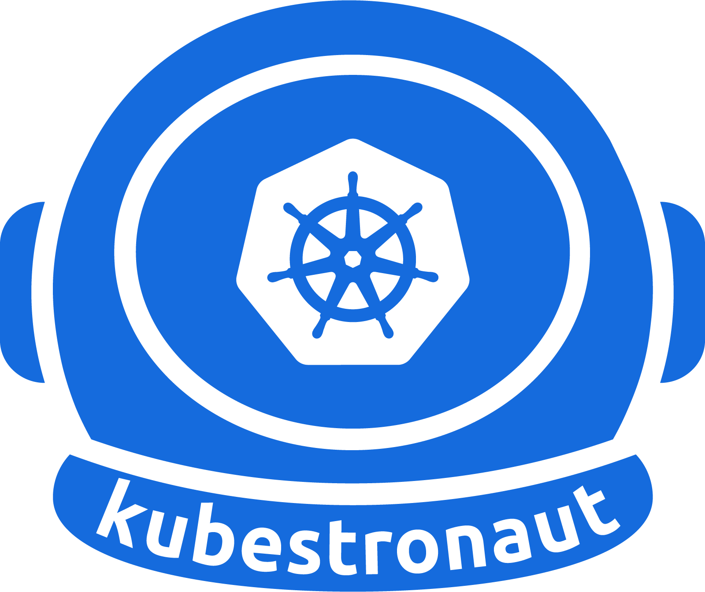
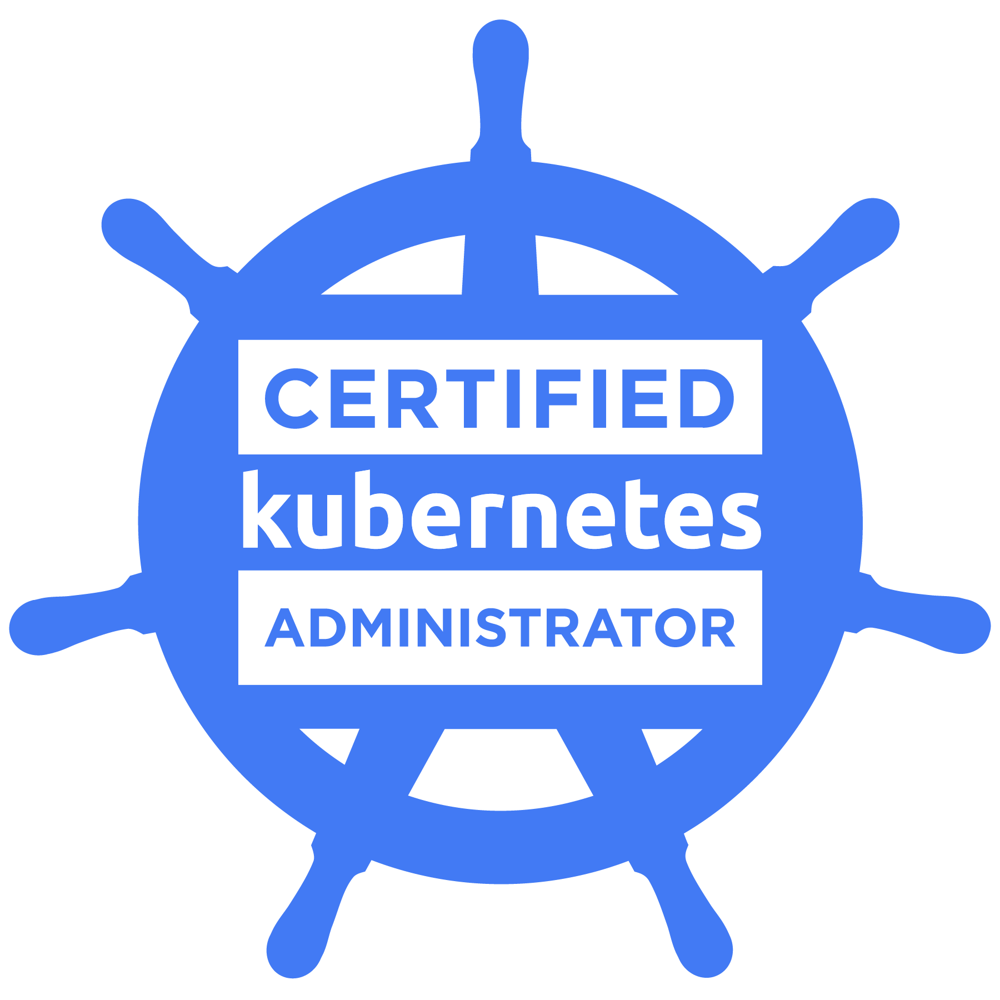
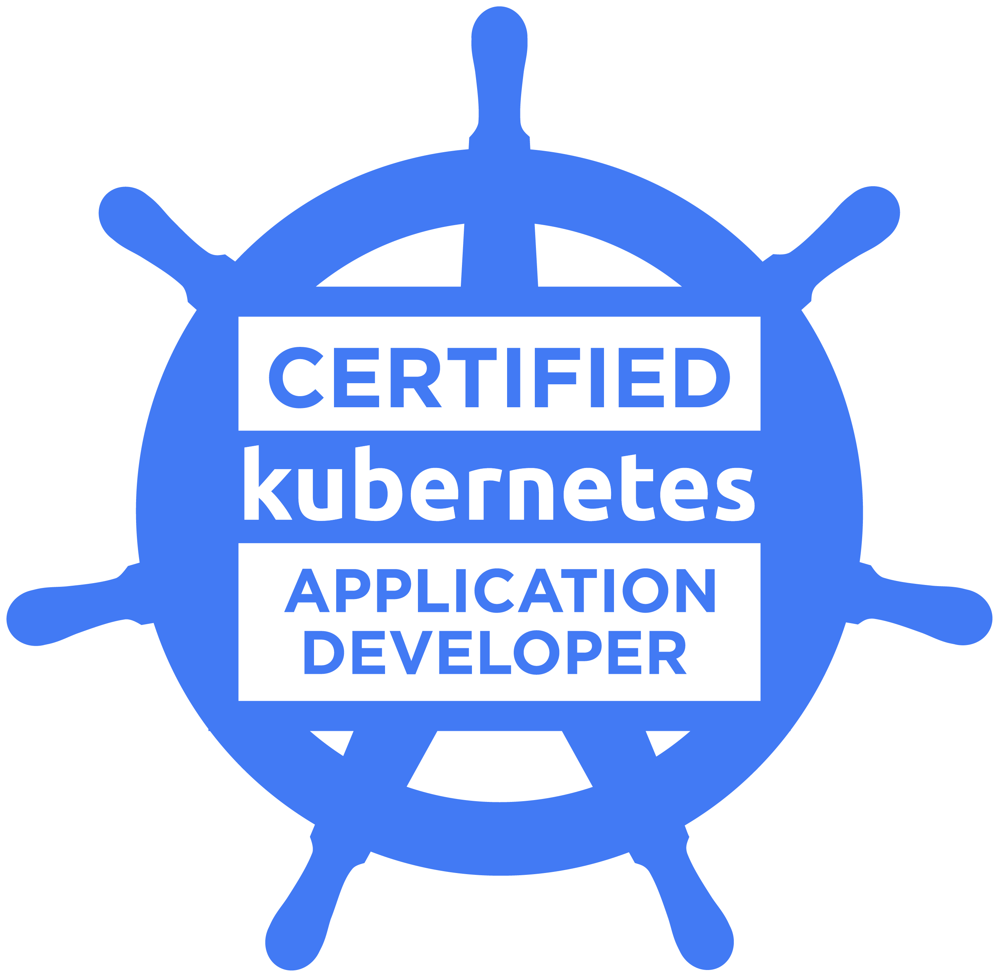
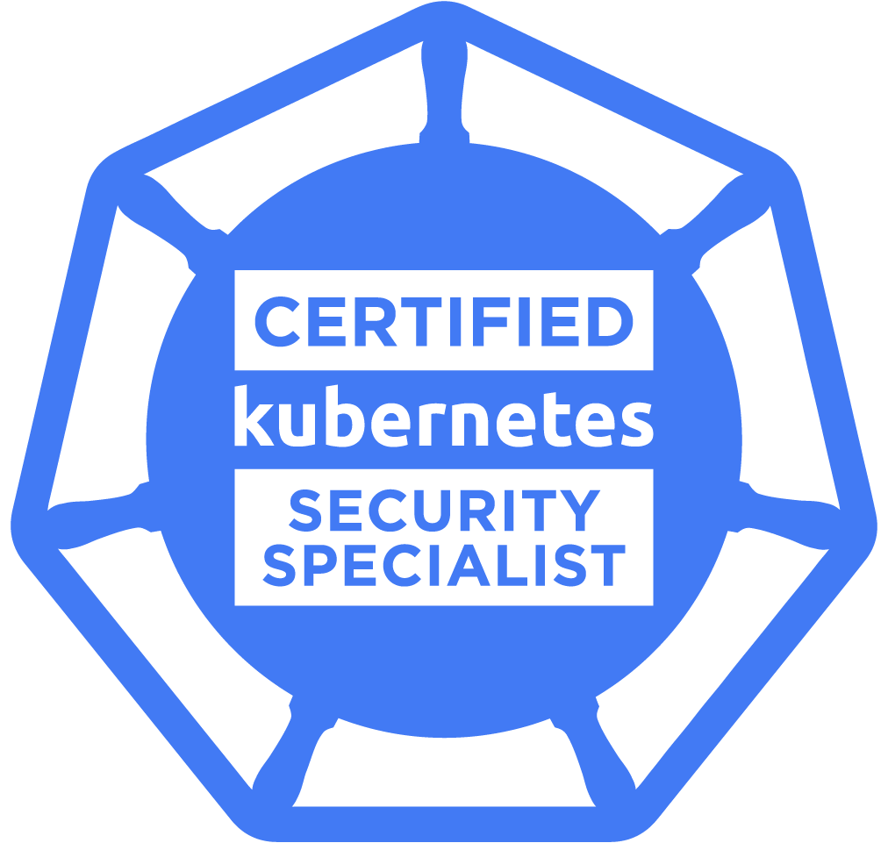
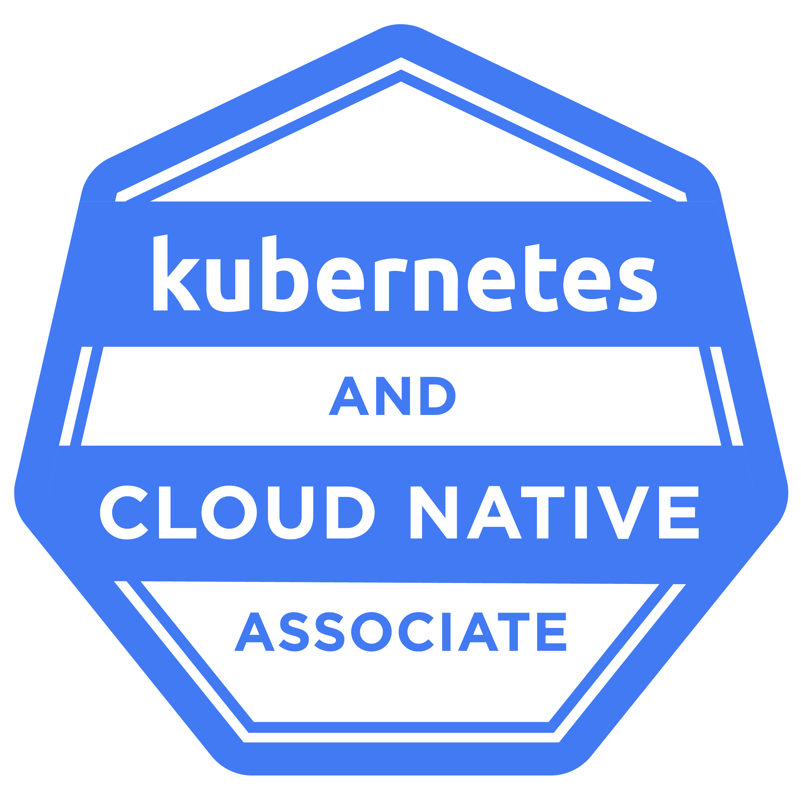
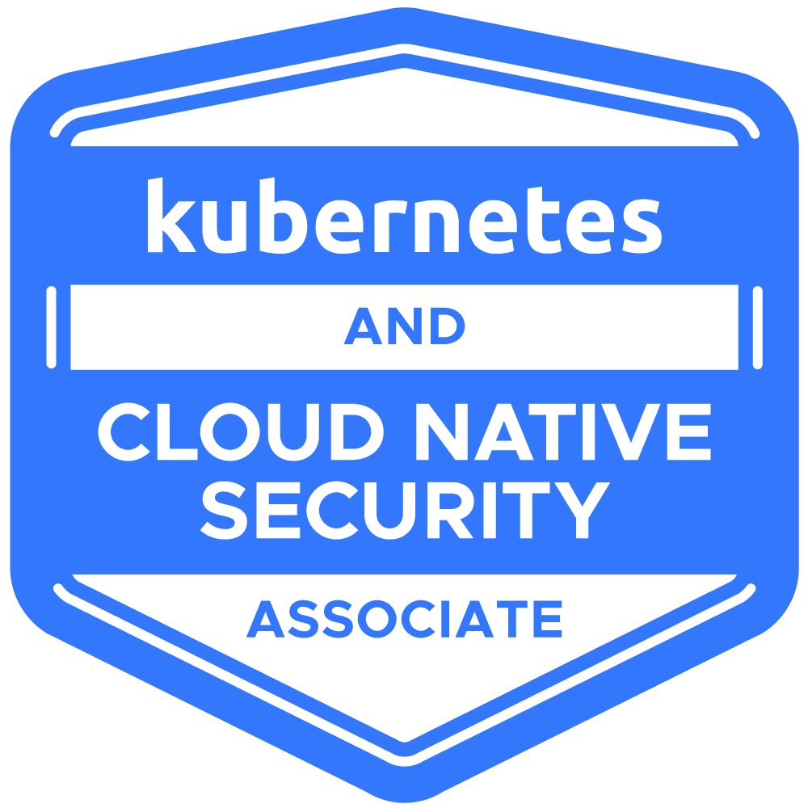
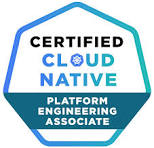

## Hi there 👋

I am an **Cloud Native Engineer** at TrueFullStaq with the interest in:
- DevOps
- Platform Engineering
- Site Reliability Engineering (SRE)
- DevSecOps, Cloud and Infrastructure Security
- Kubernetes and Containerization

📍 Graduated with a B.S. in HBO-ICT from ZUYD University of Applied Sciences, with a concentration in Datacenters, Cybersecurity, Programming, and Russian & Eurasian Language

Current mission: Golden Kubestronaut 🚀 

## Connect with Me

## Certifications

Here are some of the certifications I hold:

  
  
  
  
  
  
  

